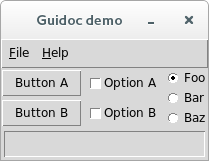
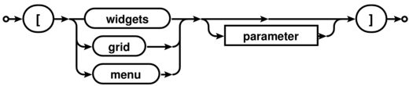
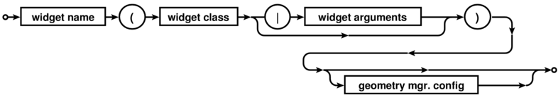
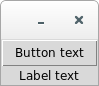
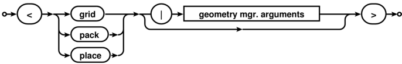
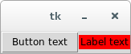
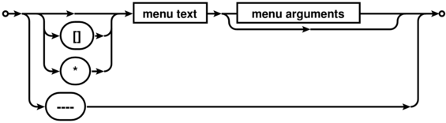

.. Guidoc documentation master file, created by
   sphinx-quickstart on Sun Aug  7 16:13:07 2016.
   You can adapt this file completely to your liking, but it should at least
   contain the root `toctree` directive.

======
Guidoc
======

Guidoc is a Python package that allows you to create `Tkinter <https://wiki.python.org/moin/TkInter>`_ widget layouts using a simple `docstring specification`_. It can be used dynamically with docstrings passed to a class decorator or to statically generate a layout method from a specification file. The specification lets you describe a widget hierarchy in a compact form with a simple indented list. This is also used to compactly describe menus. When the docutils package is installed, grid layouts can be described using ASCII tables to visually indicate where widgets are located and how they span rows or columns.

Guidoc saves you from the challenge of writing and managing complex Tkinter layouts. You can easily see the parent-child relationships between widgets and menu items and change the hierarchy with ease. Grid layouts are easy to modify at a later date without having to decipher the long forgotten row and column indices.

.. code-block:: python

  import Tkinter as tk
  from guidoc import tk_layout

  @tk_layout(r'''
  btnA(Button | text='Button A')
  btnB(Button | text='Button B')
  btnC(Button | text='Button C\n(spanning two columns)')
  frmX(Frame)
    lbl1(Label | text='Widgets default', bg='red')
    lbl2(Label | text='to using the pack', bg='white')
    lbl3(Label | text='geometry manager', bg='blue', fg='white')

  [grid]    # Grid layout for the top level widgets

  +-----+------+------+
  |btnA | btnB |      |
  +-----+------+ frmX |
  |    btnC    |      |
  +------------+------+
  ''')
  class MyApp(tk.Frame):
    def __init__(self, parent):
      tk.Frame.__init__(self, parent)
      self.pack(fill='both', expand=1)
      self._build_widgets()  # This method is generated by tk_layout()

  root = tk.Tk()
  app = MyApp(root)
  root.mainloop()

This gives rise to the following mockup:

.. image:: images/scripts/splash.png
  
What happens here is the ``tk_layout`` decorator parses the Guidoc specification string and inserts the ``_build_widgets()`` method into the ``MyApp`` class. Calling the method in the initialization code adds all of the widget and menu items declared in the specification.

.. note::

  The examples in this documentation use Python 2.7 syntax. The "Tkinter" library was renamed to "tkinter" in Python 3.x.

  
The ``guidoc.py`` file functions as a standalone module and can be directly copied into your projects. It also functions as a `command line tool for static code generation`_.

With no command line arguments the ``guidoc.py`` module will launch a demo app:

.. code-block:: sh

  > guidoc

You should be somewhat familiar with Tkinter. Guidoc simplifies some of the labor involved in creating a Tkinter application but you need to know how to write the code that connects the widgets together and makes them useful. This documentation will not teach you how to use Tkinter.

Requirements
------------

Guidoc requires either Python 2.7 or Python 3.x and no additional libraries.
It is recommended that you install the `docutils <http://docutils.sourceforge.net/>`_ package needed to parse
tabular grid layouts.

The installation script depends on setuptools which will be installed if it
isn't currently present in your Python distribution. The source is written in
Python 2.7 syntax but will convert cleanly to Python 3 when the installer
passes it through 2to3.

Licensing
---------

Guidoc is licensed for free commercial and non-commercial use under the terms of the MIT license.

Download
--------

You can access the Guidoc Git repository from `Github
<https://github.com/kevinpt/guidoc>`_. You can install direct from PyPI with the "pip"
command if you have it available.

Installation
------------

Guidoc is a Python package. You must have Python installed first to use it. Most modern Linux distributions and OS/X have it available by default. There are a number of options available for Windows. If you don't already have a favorite, I recommend getting one of the `"full-stack" Python distros <http://www.scipy.org/install.html>`_ that are geared toward scientific computing such as Anaconda or Python(x,y).

If your OS has a package manager, it may be preferable to install Python setuptools through that tool before attempting to install Guidoc. Otherwise, the installation script will install these packages directly without registering them with the OS package manager.

The easiest way to install Guidoc is from `PyPI <https://pypi.python.org/pypi/guidoc>`_.

.. code-block:: sh

  > pip install --upgrade guidoc

This will download and install the latest release, upgrading if you already have it installed. If you don't have ``pip`` you may have the ``easy_install`` command available which can be used to install ``pip`` on your system:

.. code-block:: sh

  > easy_install pip
  
You can also use ``pip`` to get the latest development code from Github:

.. code-block:: sh

  > pip install --upgrade https://github.com/kevinpt/guidoc/tarball/master

If you manually downloaded a source package or created a clone with Git you can install Guidoc with the following command run from the base Guidoc directory:

.. code-block:: sh

  > python setup.py install

On Linux systems you may need to install with root privileges using the *sudo* command.

After a successful install the Guidoc package and script will be available. On Linux they should be immediately accessible from your current search path. On Windows you will need to make sure that the ``<Python root>\Scripts`` directory is in your %PATH% environment variable.

If you can't use the installer script, it is possible to use ``guidoc.py`` directly without installation and just distribute it along with your code. If you need to use this module from Python 3 you can manually convert it with the ``2to3`` tool:

.. code-block:: sh

  > 2to3 -w guidoc.py

.. _docstring specification:

Guidoc specification syntax
---------------------------

The heart of using Guidoc is the layout specification. It is a string or separate file containing a description of the Tkinter GUI elements that will be generated.

A specification is composed of a sequence of sections. Each section begins with a line in square brackets containing the section type and an optional parameter. Section type names are case insensitive.

  Widget section heading syntax
  
Sections can be in any order. There can be only one widgets section but any number of grid and menu sections are permitted. There is an implicit widgets section at the start of the specification so you can omit the "[widgets]" section heading and begin the widget definitions immediately.

You can have comments anywhere within the specification. They are started by a "#" character and extend to the end of the line.

Widgets section
~~~~~~~~~~~~~~~

All of the widgets to be created in the layout are listed in the widgets section, one widget per line. An indented widget is the child of the parent widget at the previous indentation level. Tabs are not recognized as indentation, only spaces. Blank lines are ignored. They don't affect the hierarchy. A widget specification consists of the following:

  Widget specification syntax

Every widget name becomes an instance attribute of the class that the layout will be inserted into. They must be a valid Python identifier. The class must be a visible Tkinter widget class or a custom class with a standard Tkinter ``config()`` method. The optional parameters are a list of Python keyword arguments that would be valid for the widget constructor or its ``config()`` method.

All parameters must be a comma separated list in "<key>=<value>" format as positional parameters are not supported. Complex arguments requiring more than one line can be reserved for manual calls to the widget ``config()`` method after ``_build_widgets()`` has initialized the widgets.

To illustrate, here is a frame containing a label and a button:

.. parsed-literal::

  myFrame(Frame)
    myButton(Button | text='Button text')
    myLabel(Label | text='Label text')
    

    
These widgets expand into the following code:

.. parsed-literal::

  # Widgets
  self.myFrame = tk.Frame(self)
  self.myFrame.pack()
  self.myButton = tk.Button(self.myFrame, text='Button text')
  self.myButton.pack()
  self.myLabel = tk.Label(self.myFrame, text='Label text')
  self.myLabel.pack()
  
See how every widget becomes an attribute of the class. You can refer to them later in your own code that needs to alter the widgets, setup event bindings, etc. The frame has been used as the parent of the button and label based on their indentation. In more complex layouts you can easily revise the widget hierarchy without having to update the parent widgets since Guidoc handles it for you.

The Guidoc package will attempt to discover the name of the Tkinter library and prepend it onto any standard widgets. In this case it has been aliased to "tk". You can override this with an optional parameter to the ``tk_layout`` decorator.
  
All widgets default to using the ``pack`` geometry manager. You can override the default by appending a geometry manager configuration to the end of the widget definition. This lets you pass configuration parameters or change to the ``grid`` or ``place`` managers if needed. It has the following syntax:

  Geometry manager configuration syntax

.. note::
 
  The parameters to a widget class are copied directly into the generated code without any attempt to parse them. The parameters to the geometry manager, however, need to be parsed so that the grid sections can override row and column settings. This parsing is crude and you need to avoid any complex Python syntax that can't be handled.
 

.. parsed-literal::

  # Pack widgets horizontally
  myFrame(Frame)
    myButton(Button | text='Button text') <pack | side='left'>
    myLabel(Label | text='Label text', bg='red') <pack | side='left'>
    

    

.. parsed-literal::

  # Manually put widgets into a grid
  myFrame(Frame)
    myButton(Button | text='Button text') <grid | row=0, column=0>
    myLabel(Label | text='Label text', bg='red') <grid | row=1, column=1>

.. image:: images/scripts/basic_grid.png  

Grid sections
~~~~~~~~~~~~~

Grid sections serve as a supplement to the widgets defined in the widgets section. Each grid contains a table in one of the `two forms supported by the docutils package <http://docutils.sourceforge.net/docs/user/rst/quickref.html#tables>`_. The grid table format permits cells to span multiple columns and rows. The simple table format only permits cells to span multiple columns.

Each grid cell in the table contains a single widget name corresponding to the names defined in the widgets section. Any nested ``Frame`` widgets can have their own grid sections with a table describing how their children are arranged.

.. parsed-literal::

  [grid frameL]    # Grid table format:
  
  +------+------+
  | lblA |      |
  +------+ lblC |
  | lblB |      |
  +------+------+
  
  [grid frameR]    # Simple table format:

  # lblZ spans two columns
  ==== ====
  lblX lblY
    lblZ
  ---------
  ==== ====

.. image:: images/scripts/gridded.png

The section parameter for the grid identifies which widget the grid applies to. This must be the name of a container widget that can serve as the parent to child widgets. These are ``Frame`` and ``Toplevel`` in the built in Tkinter classes. One grid section can have its parameter omitted in which case it applies to the top level widgets for the new class being defined in your code.

After the grid is parsed, all widgets identified in the grid are converted to use the grid geometry manager. The cell coordinates and row/column span data are added to the widget specifications. Any sibling widgets missing from the grid have their default geometry manager changed to grid as well and they will be stacked in additional rows under column one.

Sibling widgets that have been explicitly set to use the ``pack`` or ``place`` geometry managers will conflict with the use of the ``grid`` geometry manager. This will cause an exception and terminate parsing of the specification.

Menu sections
~~~~~~~~~~~~~

Menus can be described in a hierarchical fashion similar to widgets. Each menu section describes a single menu tree. A row in the menu specification describes a single menu item with the following syntax:

  Menu item syntax

The menu text must be quoted if it contains spaces. You can prefix a character with "&" in the text to mark it as a keyboard accelerator. Check button menu items are preceded by "[]" and radio button items by "*".

The menu section parameter serves as the class attribute the menu will be assigned to. One menu section can have its parameter omitted, in which case it will be called "menubar". An attempt will be made to automatically configure this menu as the application menu bar if the class or its parent is an instance of ``Toplevel``. All other menus must be manually configured to become visible.

Separator lines can be created with four or more "-" characters in sequence.

For check and radio button items you will want to use the appropriate Tkinter variable objects to store their state. Radio items sharing the same variable are linked together. Menu rows that are the parent to a set of child items should have no parameters.

.. parsed-literal::

  [menu]

  &File
    &Open  command=...
    &Save  command=...
  &Settings
    [] 'Check 1'  variable=self.Check1Val
    [] 'Check 2'  variable=self.Check2Val
    ----
    * 'Radio 1'   variable=self.RadioVal, value='1'
    * 'Radio 2'   variable=self.RadioVal, value='2'
    * 'Radio 3'   variable=self.RadioVal, value='3'
  &Help
    &About  command=...
    
  ...
  # Elsewhere in your Python code:
  
  self.Check1Val = tk.IntVar()
  self.Check2Val = tk.IntVar()
  
  self.RadioVal = tk.StringVar()
  self.RadioVal.set('1')  # Initialize the value

.. image:: images/scripts/menu.png

With a menu bar, the first level of hierarchy becomes the top level menu. Subsequent levels are pull down cascade menus. Each cascade menu has its tearoff property disabled for a more up to date rendering style.

Using the decorator
-------------------

You use the ``tk_layout`` class decorator to dynamically generate the layout method. It modifies the class object by inserting a new ``_build_widgets()`` method. ``tk_layout`` is called with the following parameters:

  layout
    The layout specification. This is the only required parameter. It can be provided in place as a docstring. Use a raw docstring if you need to embed escaped characters.
   
  lib_prefix
    The Python library prefix to prepend on widget constructors
    
  libraries
    Dictionary of of library packages referenced in the specification. This can be generated with the ``lib_imports()`` function.
    
  method_name
    The name of the method to generate. This defaults to "_build_widgets"
    
  layout_file
    An optional path to a text file with the layout specification. Only used when layout is empty.
    
  require_docutils
    Raise a ``GridError`` exception when docutils is not present and a grid section is in a specification. This defaults to False.

The decorator is used on the widget subclass you create for your program. This class should inherit from any Tkinter container widget such as ``Frame`` or ``Toplevel``. It is only ran once before Python creates the class object, parsing the specification and inserting the generated method. After that no part of Guidoc will execute in your program.

If you want to refer to widgets outside of the Tkinter/tkinter package it is necessary to provide their packages as the ``libraries`` argument. Otherwise the Guidoc module can't see them when it compiles the layout specification into a code object. The ``lib_imports()`` helper function will scan your application's namespace for all imported packages and generate the ``dict`` used by this argument. You must pass in the contents of the ``globals()`` ``dict`` for it to search the packages.

.. code-block:: python

  import mywidgets as mw  # Using widgets from a separate package
  from guidoc import tk_layout, lib_imports
  
  @tk_layout('''
  myButton(mw.Button | text='Custom')
  ''', libraries=lib_imports(globals()))
  class MyApp(tk.Frame):
    ...
  

It you want the layout stored in a separate file you can use the ``layout_file`` agument to access it.

.. code-block:: python

  @tk_layout(layout_file='my_layout.txt')
  class MyDialog(tk.Frame)
    ...

Your ``__init__`` method should instantiate any Tkinter variables needed by the ``_build_widgets()`` method. After calling the method you can continue to configure the widgets with event bindings and other activities.

.. code-block:: python

  @tk_layout('''
  # Your layout specification goes here
  ''')
  class MyDialog(tk.Frame):
    def __init__(self, parent):
      tk.Frame.__init__(self, parent)

      # Create any necessary Tkinter variables here

      self._build_widgets()
      
      # Finish configuring the widgets and menus here

.. _command line tool for static code generation:

The original layout string is accessible through the ``_guidoc`` attribute of the class. The ``dump_layouts()`` convenience function will scan a namespace for any objects containing this attribute and write the value out to a file "<object name>.guidoc". This can help automate generation of static ``_build_widgets()`` methods.

.. code-block:: python
  from guidoc import dump_layouts
  
  dump_layouts(globals()) # Dump all layouts available within the current module

Static generation
-----------------

If you wish to distribute code without a dependency on Guidoc it is possible to statically generate the ``_build_widgets()`` method for insertion into your code. The easiest way is to use ``guidoc`` module on the command line with the ``-i`` option. It outputs the generated Python code to stdout.

.. code-block:: sh

  > guidoc -i layout_spec.txt > build_method.py
  > cat layout_spec.txt | guidoc -i - > build_method.py

You can also generate the code from within Python. The function ``create_layout_method()`` generates the Python code for the layout.

.. code-block:: python

  from guidoc import create_layout_method
  
  ...
  
  spec = '''
    # Layout specification here
  '''
  
  py_code = create_layout_method(spec, '_build_widgets')

It is possible to create an application that automatically switches between the dynamic layout built from a specification and a fixed static method based on the availability of Guidoc. When Guidoc is missing you define a dummy ``tk_layout()`` decorator that does nothing. In this way you can keep the ``tk_layout()`` decorator in place for documentation purposes and still distribute an application that is not dependent on Guidoc.

.. code-block:: python

  import Tkinter as tk

  # Create a dummy decorator if Guidoc is missing
  try:
    from guidoc import tk_layout
  except ImportError:
    def tk_layout(*args, **kwargs):
      return lambda cls: cls

  @tk_layout('''btnTest(Button | text="Guidoc button")''')
  class MyApp(tk.Frame):
    def __init__(self, parent):
      tk.Frame.__init__(self, parent)
      self._build_widgets()

    # This method is replaced by the real tk_layout decorator when Guidoc is available
    def _build_widgets(self):
      # Your static widget code here
      self.btnTest = tk.Button(text='Static button')
      self.btnTest.pack()

  root = tk.Tk()
  app = MyApp(root)
  app.pack()
  root.mainloop()

Any helper functions you use will also need to have a dummy substitude created.
    
Error handling
--------------

Guidoc code is only executed once at application startup for each decorated class. All error conditions are reported through exceptions. Invalid syntax in the widget, grid, and menu sections will raise an exception with some explanatory text descirbing the issue. If you depend on the grid parsing from docutils you can set the ``require_docutils`` argument of ``tk_layout()`` to ``True`` to force a ``GridException`` to be raised when the library is missing. You must resolve all exceptions before the application can produce a usable layout method. 

.. toctree::
   :maxdepth: 1
   :hidden:

Indices and tables
------------------

* :ref:`genindex`
* :ref:`search`

